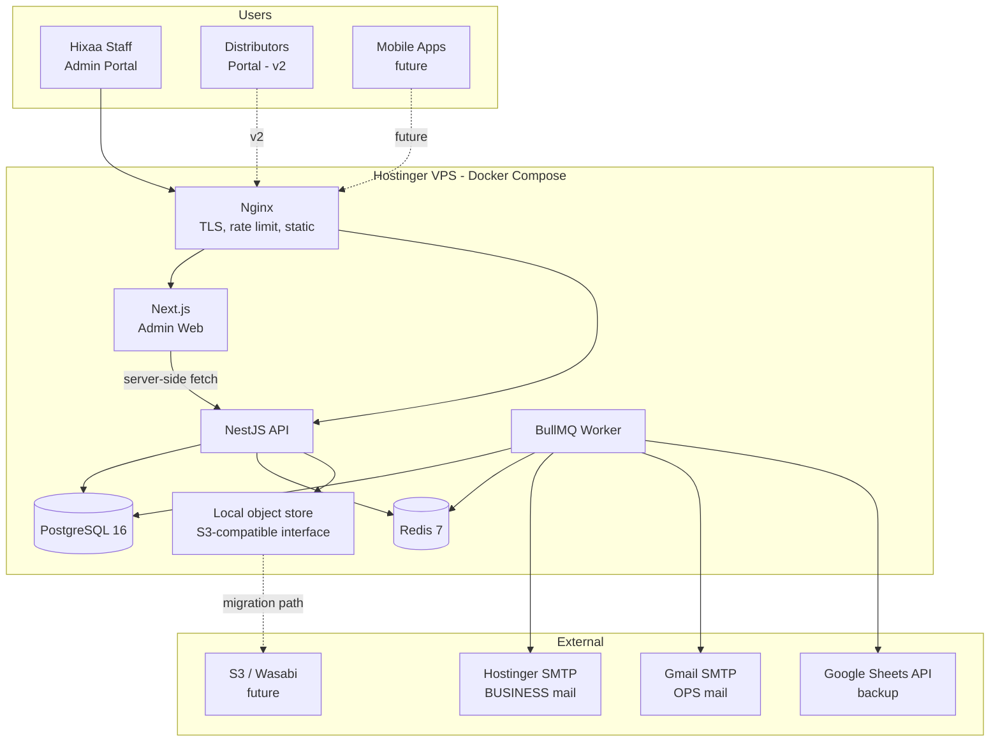

# 01 — System Architecture

> Phase 0 deliverable. Status: **Awaiting approval**

---

## 1. Architectural principles

1. **The backend is the product.** The Admin Portal is one client. The Distributor Portal and any
   future mobile app are additional clients of the *same* API. No business logic lives in the
   frontend.
2. **Authorization is a data concern, not a UI concern.** Every read is scoped in the repository
   layer. Hiding a button is presentation; it is never security.
3. **Ledgers over counters.** Stock and money are append-only ledgers with derived read models.
   Mutable balance columns drift; ledgers reconcile.
4. **Side effects go through the outbox.** Email, Google Sheets sync, notifications, and webhooks
   are never executed inline in a request. A request either commits its business transaction
   (including the outbox row) or it doesn't.
5. **One definition of a shape.** A DTO is defined once as a Zod schema in a shared package and is
   used for API validation, TypeScript types, OpenAPI generation, and frontend form validation.
6. **Boring, reproducible infrastructure.** One VPS, Docker Compose, Postgres, Redis. Nothing that
   cannot be rebuilt from a `git clone` and a `.env`.

---

## 2. System context



**Note the shape of the external edges:** every third-party call originates from the **worker**,
never from the API request path. A Google Sheets outage or a slow SMTP handshake cannot degrade
API latency. This is the direct implementation of the requirement *"Never slow down API requests
because of Google Sheets."*

---

## 3. Repository layout

A **pnpm workspace monorepo** driven by **Turborepo**. Rationale in ADR-0001.

```
hixaa-dms/
├─ apps/
│  ├─ api/                      # NestJS — REST API + Swagger
│  │  ├─ src/
│  │  │  ├─ main.ts
│  │  │  ├─ app.module.ts
│  │  │  ├─ common/             # cross-cutting, zero feature imports
│  │  │  │  ├─ decorators/      # @CurrentUser @RequirePermission @Scoped @Idempotent
│  │  │  │  ├─ filters/         # AllExceptionsFilter → RFC 7807 Problem Details
│  │  │  │  ├─ guards/          # JwtAuthGuard, PermissionsGuard, ScopeGuard, CsrfGuard
│  │  │  │  ├─ interceptors/    # RequestId, Logging, Transform, Audit, Timeout
│  │  │  │  ├─ pipes/           # ZodValidationPipe
│  │  │  │  ├─ errors/          # DomainError hierarchy
│  │  │  │  └─ utils/           # Money, GstCalculator, Pagination, Slug
│  │  │  ├─ infrastructure/     # adapters to the outside world
│  │  │  │  ├─ database/        # PrismaService, extensions (soft-delete, audit, scope)
│  │  │  │  ├─ cache/           # RedisService, CacheKey registry
│  │  │  │  ├─ queue/           # BullMQ registration, queue names
│  │  │  │  ├─ storage/         # StorageService iface + Local & S3 drivers
│  │  │  │  ├─ mail/            # MailService, BUSINESS + OPS transports, templates
│  │  │  │  ├─ search/          # SearchProvider iface + Postgres FTS driver
│  │  │  │  └─ sheets/          # Google Sheets client
│  │  │  ├─ modules/            # feature modules — see §5
│  │  │  │  ├─ auth/  users/  roles/  teams/
│  │  │  │  ├─ distributors/  territories/  customers/
│  │  │  │  ├─ catalog/  pricing/  inventory/  warehouses/
│  │  │  │  ├─ quotations/  orders/  shipments/
│  │  │  │  ├─ invoices/  payments/  ledger/  tax/
│  │  │  │  ├─ documents/  notifications/  reports/  analytics/
│  │  │  │  ├─ audit/  settings/  search/  backup/
│  │  │  │  └─ health/
│  │  │  └─ jobs/               # BullMQ processors (run in worker process)
│  │  ├─ prisma/
│  │  │  ├─ schema/             # split .prisma files, merged at generate
│  │  │  ├─ migrations/
│  │  │  └─ seed/               # idempotent seeders incl. Hixaa portfolio data
│  │  └─ test/                  # e2e (supertest + testcontainers)
│  │
│  └─ web/                      # Next.js 15 App Router — Admin Portal
│     ├─ src/
│     │  ├─ app/
│     │  │  ├─ (auth)/          # login, forgot, reset, verify
│     │  │  ├─ (dashboard)/     # authenticated shell
│     │  │  │  ├─ distributors/ products/ inventory/ orders/
│     │  │  │  ├─ invoices/ payments/ customers/ reports/
│     │  │  │  └─ settings/
│     │  │  └─ api/             # BFF route handlers: cookie ↔ bearer bridge only
│     │  ├─ components/         # ui/ (shadcn)  layout/  data-table/  forms/  charts/
│     │  ├─ features/           # per-domain hooks + api clients + schemas
│     │  ├─ lib/                # api-client, query-client, permissions, formatters
│     │  └─ styles/
│     └─ e2e/                   # Playwright
│
├─ packages/
│  ├─ contracts/                # ⭐ Zod schemas + inferred types + permission keys + enums
│  ├─ ui/                       # shared design-system primitives
│  ├─ config/                   # eslint, tsconfig, tailwind, prettier presets
│  └─ testing/                  # factories, fixtures, test utils
│
├─ infra/
│  ├─ docker/                   # Dockerfiles (api, web, worker) + nginx.conf
│  ├─ compose/                  # docker-compose.{yml,dev,prod}.yml
│  └─ scripts/                  # deploy.sh backup.sh restore.sh healthcheck.sh
│
├─ docs/                        # this documentation set
└─ .github/workflows/           # CI: lint, typecheck, test, build, migrate-check
```

### Why `packages/contracts` is the keystone

```ts
// packages/contracts/src/distributor/create-distributor.schema.ts
export const createDistributorSchema = z.object({
  legalName: z.string().min(2).max(200),
  gstin: z.string().regex(GSTIN_REGEX).optional(),
  creditLimit: moneySchema.default('0'),
  territoryId: z.string().uuid(),
});
export type CreateDistributorDto = z.infer<typeof createDistributorSchema>;
```

That single file is consumed by:

| Consumer | Use |
|---|---|
| NestJS `ZodValidationPipe` | Runtime request validation |
| `nestjs-zod` / `zod-to-openapi` | Swagger schema generation |
| Next.js React Hook Form resolver | Client-side validation with identical rules |
| Both apps' TypeScript | The `CreateDistributorDto` type |

A validation rule can therefore never disagree between client and server, because there is only
one rule. This eliminates an entire class of bug that plagues split-repo setups.

---

## 4. Backend layering (Clean Architecture, pragmatically applied)

```
HTTP  →  Controller  →  Service  →  Repository  →  Prisma  →  Postgres
              ↓            ↓            ↓
          Guards/      Domain      Scope filter
          Pipes        rules       injection
```

| Layer | Responsibility | Must not |
|---|---|---|
| **Controller** | HTTP shape, status codes, OpenAPI decoration. Thin. | Contain business rules or touch Prisma |
| **Service** | Business rules, transaction boundaries, orchestration, outbox writes | Know about HTTP (`Request`, `Response`, cookies) |
| **Repository** | Query construction, scope filtering, pagination, `select` shaping | Contain business rules |
| **Domain** | Value objects (`Money`, `Gstin`, `HsnCode`), calculators, invariants | Perform I/O |

We apply the Repository Pattern **selectively**: complex aggregates (Order, Invoice, Inventory,
Ledger) get explicit repositories because their queries are intricate and scope-sensitive. Simple
CRUD modules (Settings, UOM, Industry) call a generic `BaseRepository<T>` rather than growing a
ceremonial class per table. Purity that adds no safety is cost, not quality.

### Transaction boundaries

Business transactions are opened in the **service**, and every write within — including the
`OutboxEvent` — participates:

```ts
await this.prisma.$transaction(async (tx) => {
  const order    = await this.orderRepo.create(tx, dto);
  await this.creditService.assertWithinLimit(tx, order);      // invariant
  await this.inventoryService.reserve(tx, order.lines);       // ledger + balance, row-locked
  await this.outbox.emit(tx, 'order.approved', order.id, payload);
}, { isolationLevel: 'ReadCommitted', timeout: 15_000 });
```

If any step throws, the reservation, the order, and the queued email all roll back together.
There is no state in which an email announces an order that does not exist.

### Prisma client extensions (applied globally)

| Extension | Behaviour |
|---|---|
| **Soft delete** | `delete` → `update { deletedAt }`; all reads inject `deletedAt: null` unless `withDeleted()` |
| **Audit** | Captures before/after images on mutations and writes `AuditLog` rows |
| **Scope** | Injects the caller's territory/distributor predicate into every scoped model's `where` |
| **Slow query log** | Logs any query over 200 ms with its params redacted |

Enforcing scope at the client-extension level rather than per-query means **forgetting to filter is
not possible** — the default is safe and opting out is explicit and greppable.

---

## 5. Feature module anatomy

Every backend module has the same shape, so a developer who has read one has read all of them:

```
modules/orders/
├─ orders.module.ts
├─ orders.controller.ts        # HTTP
├─ orders.service.ts           # orchestration + rules
├─ orders.repository.ts        # queries
├─ order-pricing.service.ts    # single responsibility: line totals + discounts
├─ order-status.machine.ts     # explicit FSM, no scattered if-statements
├─ dto/                        # re-exported from @hixaa/contracts
├─ events/                     # order.approved, order.dispatched …
└─ __tests__/
```

Order status is an explicit finite state machine rather than string comparisons sprinkled through
services. Illegal transitions (`DELIVERED → DRAFT`) are rejected by the machine, in one place, with
one test file.

---

## 6. Frontend architecture

- **Next.js 15 App Router**, React Server Components for the initial shell, Client Components for
  interactive tables and forms.
- **TanStack Query** owns all server state. No Redux; there is very little genuine client state,
  and inventing a global store for server data is the most common cause of stale-data bugs.
- **Route handlers as a thin BFF.** The browser holds an HTTP-only cookie; the Next.js route handler
  exchanges it for the bearer token sent to NestJS. **Access tokens never touch JavaScript**, which
  removes token theft via XSS as a viable attack.
- **`<DataTable>` is one component.** Server-driven pagination, sorting, filtering, column
  visibility, saved views, and CSV export are implemented once and configured per resource. Twelve
  hand-rolled tables is the failure mode we are designing against.
- **Permission-aware rendering.** `usePermission('order:approve')` hides the control; the server
  independently enforces it. Both, always.

---

## 7. Cross-cutting concerns

| Concern | Implementation |
|---|---|
| **Config** | `@nestjs/config` + a Zod schema validated at boot. A missing or malformed env var crashes on startup, never at 2 a.m. in a request |
| **Logging** | Pino, structured JSON, `requestId` propagated via `AsyncLocalStorage`, automatic redaction of `password`, `token`, `authorization`, `gstin`, `pan` |
| **Errors** | `DomainError` hierarchy → `AllExceptionsFilter` → RFC 7807 Problem Details. Stack traces never leave the server |
| **Caching** | Redis, explicit `CacheKey` registry with documented TTL and invalidation owner. No implicit caching |
| **Jobs** | BullMQ queues: `email`, `sheets-sync`, `reports`, `notifications`, `maintenance`. Exponential backoff, DLQ, idempotent processors |
| **Idempotency** | `Idempotency-Key` header on POST for orders/payments; replayed keys return the stored response |
| **Health** | `/health/live` (process up) and `/health/ready` (DB + Redis reachable) for Compose healthchecks |
| **Rate limiting** | Nginx (coarse, per-IP) + `@nestjs/throttler` (fine, per-user/route). Auth endpoints are far stricter |

---

## 8. Scalability plan

The requirement is 100k+ distributors, 1M+ products, millions of records. Concretely:

1. **Keyset pagination** on every large list (`WHERE (created_at, id) < (?, ?)`). `OFFSET 50000`
   makes Postgres read and discard 50 000 rows; keyset reads exactly the page.
2. **Covering indexes** designed alongside the queries, listed in `02-data-model.md` §6.
3. **`AuditLog` partitioned by month** with a retention/detach policy. It is the fastest-growing
   table in any ERP and must never be allowed to bloat the primary working set.
4. **Materialised views** for every dashboard KPI, refreshed concurrently by the worker. Dashboards
   never aggregate raw order lines at request time.
5. **Full-text search** via a generated `tsvector` column plus a GIN index, and `pg_trgm` for fuzzy
   matching. Behind a `SearchProvider` interface, so adopting Meilisearch later is one new class.
6. **Read-replica ready** — the Prisma service already distinguishes read and write clients, so
   pointing reads at a replica is configuration, not refactoring.
7. **Horizontal path** — API and worker are stateless; sessions live in Redis. Scaling is
   `docker compose up --scale api=3` behind Nginx, with no code change.

---

## 9. Technology decisions and deviations

The stack is as specified. Three additions and one deviation, each justified:

| Item | Decision | Reason |
|---|---|---|
| Turborepo + pnpm workspaces | **Added** | The shared `contracts` package needs a build graph and cache; without it, CI rebuilds everything on every commit |
| `nestjs-zod` | **Added** | Bridges Zod → NestJS validation → OpenAPI, avoiding a duplicate `class-validator` DTO layer |
| Prisma `Decimal` + a `Money` value object | **Added** | Floating-point money is a correctness bug, not a style preference. See ADR-0004 |
| **Recharts** | **Kept** as specified | Adequate for the dashboards described. If a chart type proves limiting we will raise it rather than swap silently |
| Framer Motion | **Kept, used sparingly** | Motion is for state transitions and feedback, not decoration. An ERP that bounces is an ERP that annoys by week two |

---

## 10. Environments

| Environment | Where | Data | Purpose |
|---|---|---|---|
| **Local** | Developer machine, Compose | Seeded synthetic | Development |
| **Test** | CI, ephemeral Testcontainers Postgres | Per-run fixtures | Automated tests |
| **Staging** | Hostinger VPS, second Compose project on separate ports | Anonymised copy | Pre-release verification |
| **Production** | Hostinger VPS | Live | Real use |

Staging and production share one VPS in v1 but are fully isolated Compose projects with separate
databases, volumes, and secrets. If load justifies it later, staging moves to its own box with no
code change.
