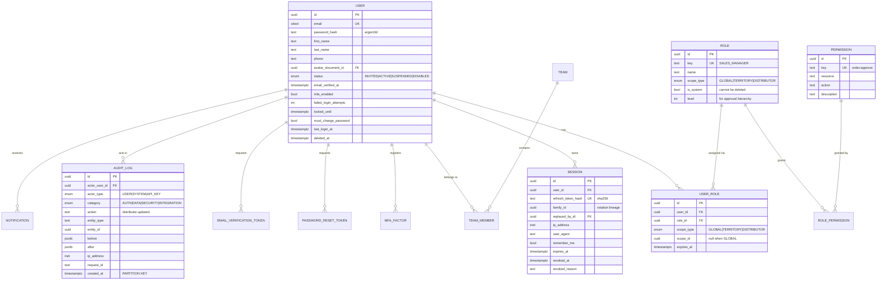
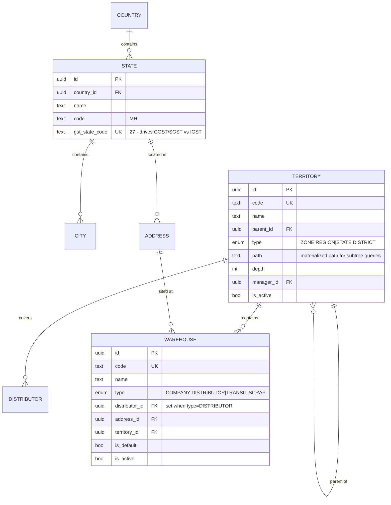
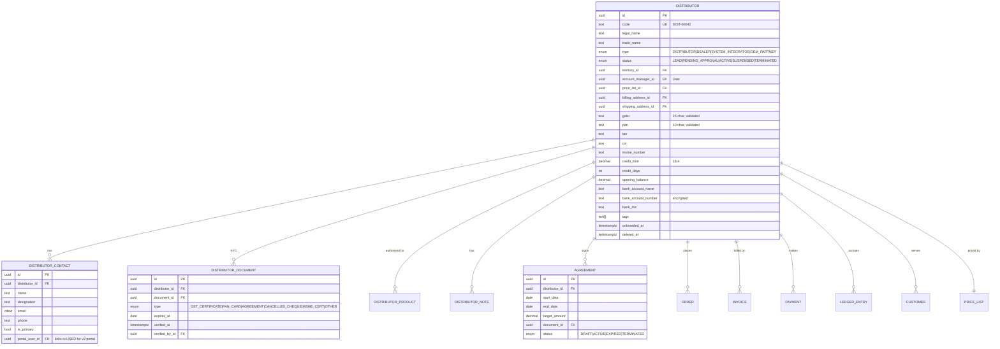
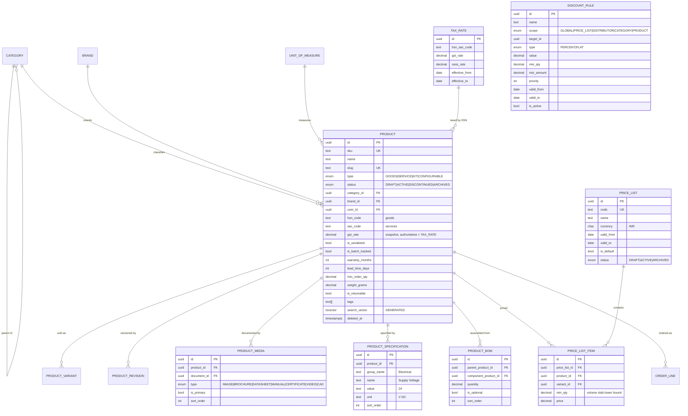
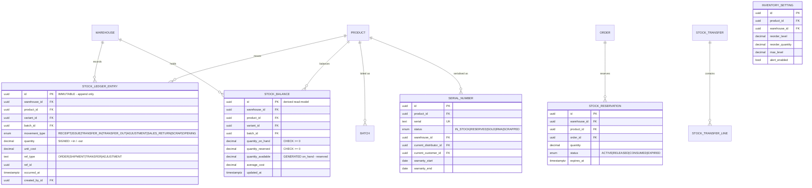
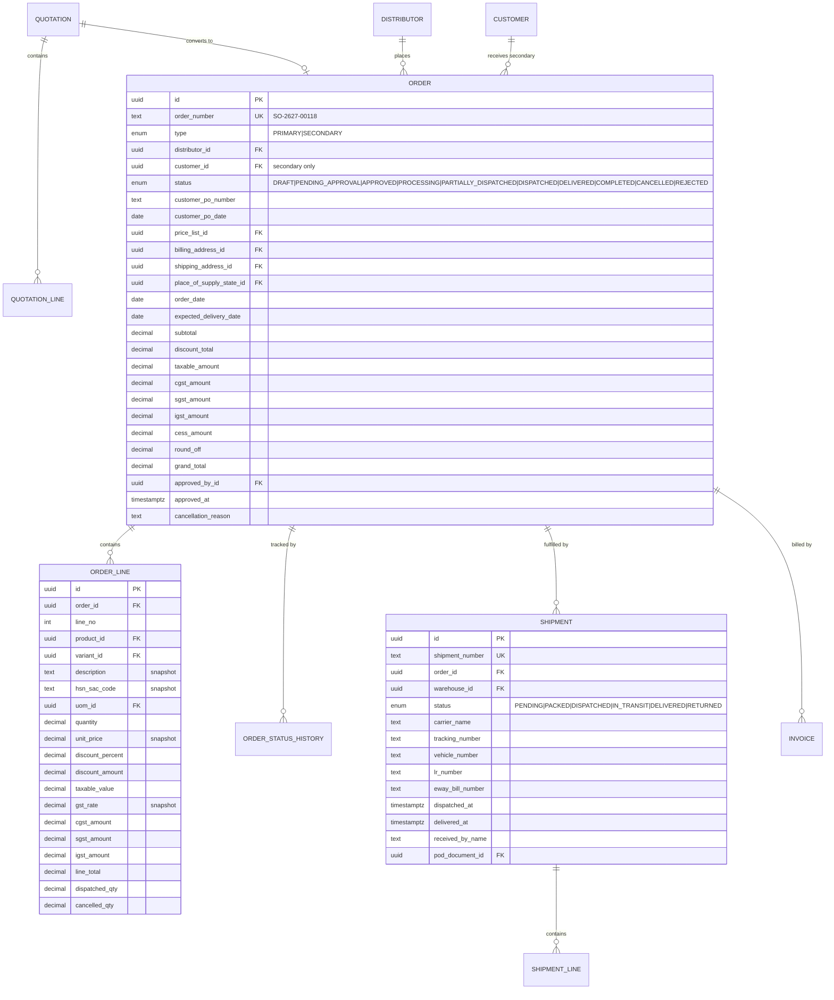
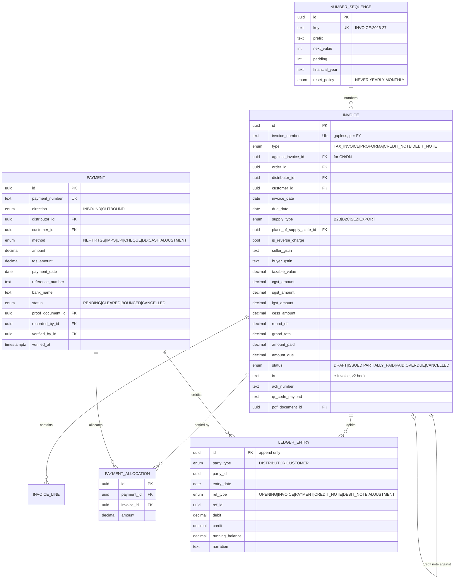
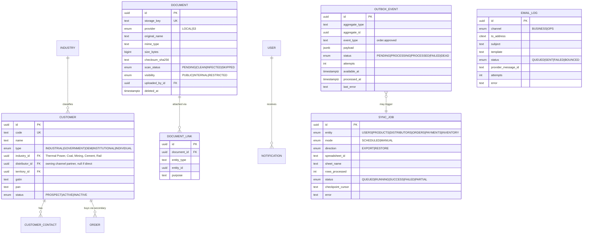

# 02 — Database Schema & ER Diagrams

> Phase 0 deliverable. Status: **Awaiting approval**
> Target: PostgreSQL 16 · Prisma ORM · ~70 tables across 9 bounded contexts

---

## 0. Conventions applied to every table

| Convention | Rule |
|---|---|
| **Primary key** | `id` — UUID v7 (time-sortable, so index locality matches insert order; avoids the random-UUID B-tree fragmentation problem) |
| **Timestamps** | `createdAt`, `updatedAt` on every table; `deletedAt` on every soft-deletable table |
| **Attribution** | `createdById`, `updatedById` on all business entities |
| **Soft delete** | `deletedAt TIMESTAMPTZ NULL`. Enforced by Prisma extension. Financial documents are **never** deleted, only cancelled |
| **Money** | `DECIMAL(18,4)` — never `float`/`double`. Wrapped by a `Money` value object. See ADR-0004 |
| **Quantity** | `DECIMAL(18,4)` — services bill in fractional hours |
| **Percent** | `DECIMAL(7,4)` — supports 18.5000% and 0.0125% |
| **Enums** | Native Postgres enums via Prisma. Additive-only changes |
| **Naming** | `snake_case` in Postgres, `camelCase` in Prisma/TS via `@map` |
| **Human codes** | Every business entity has a human-readable `code` (`DIST-00042`, `SO-2627-00118`) separate from its UUID |
| **Timezone** | All timestamps `TIMESTAMPTZ`, stored UTC. `Asia/Kolkata` applied at presentation only |

---

## 1. Identity, Access & Audit



**`USER_ROLE.scope_type` + `scope_id` is the single mechanism** that will make the future
Distributor Portal safe. A distributor user is simply a `User` with a role assignment scoped to
`DISTRIBUTOR:<id>`. No parallel user table, no second auth system. See ADR-0003.

Also in this context: `TEAM`, `TEAM_MEMBER`, `MFA_FACTOR` (TOTP secret encrypted at rest, backup
codes hashed), `API_KEY` (hashed, scoped, expiring), `IDEMPOTENCY_KEY`.

---

## 2. Geography & Organisation



`STATE.gst_state_code` is not decoration — it is the input to the place-of-supply rule that decides
whether a line is taxed CGST+SGST or IGST. Getting it wrong produces legally incorrect invoices.

`TERRITORY.path` (materialised path, e.g. `west/maharashtra/vidarbha`) makes "all orders in the West
zone" a single indexed `path LIKE 'west/%'` instead of a recursive CTE per request.

---

## 3. Distributors (Channel Partners)



`DISTRIBUTOR_CONTACT.portal_user_id` is the seam for the v2 portal: onboarding a distributor user
is creating a `User` and linking it, not building a new subsystem.

---

## 4. Catalog & Pricing



Four things worth calling out:

1. **`PRODUCT.type = KIT` + `PRODUCT_BOM`** is what lets a "Raksha IoT — 50 Worker Deployment" be a
   sellable line item that explodes into gateways, tags, licences, and commissioning.
2. **`PRODUCT_SPECIFICATION`** is a proper table, not a JSON blob, because industrial buyers filter
   on specs ("show me DAQ modules with 24 V DC supply") and JSON cannot be indexed for that as
   cheaply.
3. **`TAX_RATE` is date-effective.** When a GST rate changes, we insert a row. Historical invoices
   keep their historical rate. Nothing is edited.
4. **`search_vector` is a generated column** over name, SKU, description and tags, with a GIN index —
   full-text search with zero application-side maintenance.

---

## 5. Inventory — ledger-based



### Why a ledger and not a counter

A mutable `stock_quantity` column is the single most common source of data corruption in
inventory systems: two concurrent dispatches read 10, both subtract 6, and the column says 4 when
it should say -2. It is unrecoverable because there is no history to reconcile against.

The ledger design instead:

- `STOCK_LEDGER_ENTRY` is **append-only and immutable**. It is the source of truth and a complete
  audit trail. Adjustments are new compensating rows, never edits.
- `STOCK_BALANCE` is a derived read-model updated **in the same transaction** as the ledger, under
  `SELECT … FOR UPDATE` on the balance row. Concurrent movements serialise on that row lock.
- A `CHECK (quantity_on_hand >= 0)` constraint is the final backstop — the database itself refuses
  to hold negative stock even if application logic is bypassed.
- A nightly reconciliation job re-derives every balance from the ledger and alerts on any drift,
  which means a bug is detected in hours rather than discovered in an annual stock count.

`SERIAL_NUMBER` tracks a Raksha IoT device from Hixaa's warehouse to a distributor to a specific
plant, with its warranty window — directly serving the traceability need identified in §1.1 of the
domain study.

---

## 6. Sales — Quotations, Orders, Shipments



**Every price, rate, description and HSN code on an `ORDER_LINE` is a snapshot**, deliberately
denormalised. If a product is renamed or repriced next year, a historical order must still print
exactly what was agreed. Joining live catalog data into a historical document is a classic and
expensive mistake.

---

## 7. Finance — Invoices, Payments, Ledger, Tax



### Three deliberate design choices here

1. **`PAYMENT_ALLOCATION` is a join table with an amount**, not a foreign key from payment to
   invoice. Real distributors pay ₹5,00,000 against four invoices at once, or part-pay one. A
   one-to-one link cannot express that and forces users into fictional data entry.
2. **`LEDGER_ENTRY` is the truth for outstanding balances.** Aging buckets, statements of account,
   and credit checks all read from it. There is no mutable `outstanding` column to drift.
3. **`NUMBER_SEQUENCE` allocates inside the invoice transaction** with `SELECT … FOR UPDATE`.
   Under Indian GST, gaps in an invoice series invite scrutiny; generating numbers optimistically
   in application code produces gaps whenever a transaction rolls back.

### GST computation rule (implemented in `GstCalculator`, tested exhaustively)

```
supplier_state = Hixaa's GSTIN state (27 — Maharashtra)
place_of_supply = ORDER.place_of_supply_state_id  (buyer's shipping state, per §10 IGST Act)

if supplier_state == place_of_supply:   CGST = SGST = rate/2   ; IGST = 0
else:                                   IGST = rate            ; CGST = SGST = 0

Rounding: per line, half-up to 2 decimals. Invoice round_off absorbs the residual
so that grand_total is a whole rupee.
```

---

## 8. Customers, Documents, Notifications, Ops



Also here: `SYSTEM_SETTING` (jsonb, category-keyed — holds the company profile, branding, portfolio
content, and feature flags so the Admin Panel can edit them), `NOTIFICATION`,
`NOTIFICATION_PREFERENCE`, `SAVED_REPORT`, `REPORT_RUN`, `SCHEDULED_REPORT`, `FEATURE_FLAG`.

**`SYSTEM_SETTING` is how we honour "do not hardcode portfolio data."** Company name, address,
GSTIN, logo, service lines, and industries are seeded rows, editable from Settings, cached in Redis.

---

## 9. Index strategy

Indexes are designed with the queries, not bolted on after a slow-query report.

| Table | Index | Serves |
|---|---|---|
| `user` | `UNIQUE (lower(email)) WHERE deleted_at IS NULL` | Login; case-insensitive uniqueness |
| `session` | `(refresh_token_hash)`, `(user_id, revoked_at)`, `(family_id)` | Refresh rotation + reuse detection |
| `distributor` | `(status, territory_id)`, `(account_manager_id)`, GIN `(search_vector)`, `UNIQUE (gstin) WHERE gstin IS NOT NULL` | Scoped lists, search, GST uniqueness |
| `product` | GIN `(search_vector)`, `(category_id, status)`, `(status, created_at DESC, id DESC)` | Catalog browse, search, keyset pagination |
| `product` | GIN `(tags)`, `gin_trgm_ops (name)` | Tag filter, fuzzy/typo search |
| `stock_balance` | `UNIQUE (warehouse_id, product_id, variant_id, batch_id)` | The row lock target |
| `stock_balance` | `(product_id) WHERE quantity_available <= 0` (partial) | Out-of-stock dashboards, tiny index |
| `stock_ledger_entry` | `(warehouse_id, product_id, occurred_at DESC)`, `(ref_type, ref_id)` | Movement history, reconciliation |
| `order` | `(distributor_id, status, order_date DESC)`, `(status, expected_delivery_date)` | Distributor 360, fulfilment queue |
| `order` | `(order_date DESC, id DESC)` | Keyset pagination |
| `order_line` | `(order_id, line_no)`, `(product_id, created_at)` | Line fetch, product performance |
| `invoice` | `(distributor_id, status)`, `(status, due_date) WHERE status <> 'PAID'` (partial) | Aging & overdue — the hot finance query |
| `ledger_entry` | `(party_type, party_id, entry_date DESC)` | Statement of account |
| `audit_log` | `(entity_type, entity_id, created_at DESC)`, `(actor_user_id, created_at DESC)` | Entity history, user activity |
| `outbox_event` | `(status, available_at) WHERE status IN ('PENDING','FAILED')` (partial) | The dispatcher's poll — stays small forever |

**Partial indexes are used deliberately.** `invoice(status, due_date) WHERE status <> 'PAID'`
indexes only open invoices — a few thousand rows instead of millions — and it is the query the
finance team runs constantly.

---

## 10. Partitioning & retention

| Table | Strategy |
|---|---|
| `audit_log` | `PARTITION BY RANGE (created_at)`, monthly. Partitions older than 24 months detached to cold storage after Sheets/dump backup |
| `stock_ledger_entry` | Monitored; partition by year once past ~50M rows. Schema is partition-ready from day one |
| `email_log`, `outbox_event` | Processed rows purged after 90 days by a maintenance job |
| `session` | Expired rows purged nightly |

---

## 11. Migration & seed policy

- **Migrations are forward-only** and reviewed like code. Destructive changes (drop column, narrow
  type) require an explicit two-release expand/contract: add → backfill → switch reads → drop.
- **`prisma migrate deploy` runs as a one-shot container** before the API starts, never on app boot
  in parallel replicas.
- **Seeds are idempotent** (`upsert` on natural keys) and split:
  - `seed:system` — permissions, roles, GST state codes, UOMs, number sequences. Runs in production.
  - `seed:portfolio` — Hixaa company profile, service-line categories, industries, and the
    Raksha IoT product with its real specifications. Runs in production.
  - `seed:demo` — synthetic distributors, orders, payments for development. **Never in production**,
    guarded by `NODE_ENV`.
